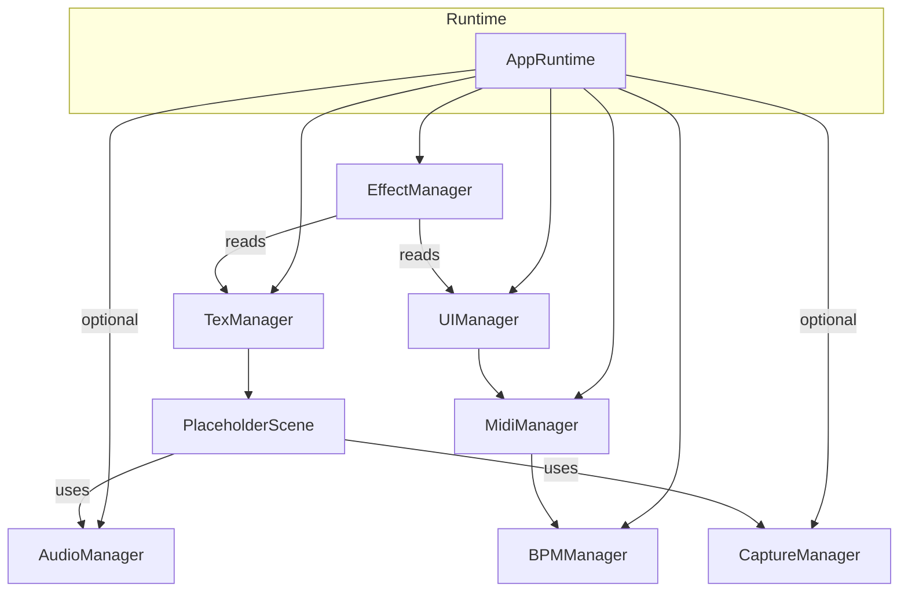

# アーキテクチャ概要

## 主要コンポーネント

| コンポーネント | 役割 | 主な連携先 |
| --- | --- | --- |
| AppRuntime | p5 の `setup`/`draw` から呼び出される統括モジュール。設定値に応じて各 Manager を初期化し、毎フレームの更新順序を制御する。 | TexManager, EffectManager, UIManager, BPMManager, MIDI/Audio/Capture |
| TexManager | レンダリング用 `p5.Graphics` を生成し、アクティブシーン (`PlaceholderScene`) に描画を委譲する。 | PlaceholderScene, EffectManager |
| PlaceholderScene | MIDI フェーダー値・ビート・Audio/Capture の状態を参照してオフスクリーンにコンテンツを描画するサンプルシーン。 | TexManager, AudioMicManager, CaptureManager |
| EffectManager | TexManager と UIManager の出力を GLSL シェーダーで合成し、最終フレームを描画する。 | TexManager, UIManager |
| UIManager | UI オーバーレイを `p5.Graphics` に描画し、最終フレームへ合成する。 | MIDI, EffectManager |
| BPMManager | ビート進行とテンポ変化を管理し、AppRuntime から各フレームで参照される。 | AppRuntime, MIDI |
| AudioMicManager | マイク入力の振幅と周波数データを提供する。AppRuntime からオプションで参照され、シーン描画時に活用される。 | AppRuntime, PlaceholderScene |
| CaptureManager | Web カメラのフレームを `p5.Graphics` に転写し、シーンから利用できるようにする。 | AppRuntime, PlaceholderScene |
| APCMiniMK2Manager | Web MIDI を通じて APC Mini MK2 を操作し、フェーダー値・ボタン状態を他コンポーネントへ渡す。 | AppRuntime, UIManager, PlaceholderScene |

> AudioMicManager / CaptureManager は `enableAudio`・`enableCapture` のフラグで初期化を制御でき、未使用時は `undefined` として各モジュールへ伝播されます。
